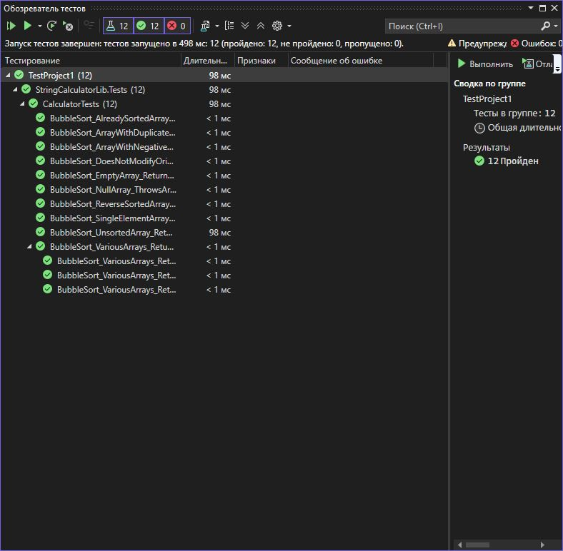

# Практическая работа №4: Написание первых юнит-тестов с xUnit

**Вариант: 15**

**Задание:**
Метод int[] BubbleSort(int[] array) сортирует массив целых чисел по возрастанию методом пузырька.


## Структура проекта

- `StringCalculatorLib/`: Реализация метода `ReverseString`.
- `StringCalculatorLib.Tests/`: Юнит-тесты на данный метод.
- `images/`: Скриншот результатов тестирования.
- `README.md`: Инструкция и описание.

## Класс `StringUtils`

```csharp
using Xunit;
using StringCalculatorLib;
using System;

namespace StringCalculatorLib.Tests
{
    public class CalculatorTests
    {
        private readonly Calculator _calculator;

        public CalculatorTests()
        {
            // Инициализация калькулятора для всех тестов
            _calculator = new Calculator();
        }

        [Fact]
        public void BubbleSort_NullArray_ThrowsArgumentNullException()
        {
            // Arrange
            int[] array = null;

            // Act & Assert
            Assert.Throws<ArgumentNullException>(() => _calculator.BubbleSort(array));
        }

        [Fact]
        public void BubbleSort_EmptyArray_ReturnsEmptyArray()
        {
            // Arrange
            int[] array = new int[0];
            int[] expected = new int[0];

            // Act
            int[] result = _calculator.BubbleSort(array);

            // Assert
            Assert.Equal(expected, result);
        }

        [Fact]
        public void BubbleSort_SingleElementArray_ReturnsSameArray()
        {
            // Arrange
            int[] array = { 42 };
            int[] expected = { 42 };

            // Act
            int[] result = _calculator.BubbleSort(array);

            // Assert
            Assert.Equal(expected, result);
        }

        [Fact]
        public void BubbleSort_AlreadySortedArray_ReturnsSameArray()
        {
            // Arrange
            int[] array = { 1, 2, 3, 4, 5 };
            int[] expected = { 1, 2, 3, 4, 5 };

            // Act
            int[] result = _calculator.BubbleSort(array);

            // Assert
            Assert.Equal(expected, result);
        }

        [Fact]
        public void BubbleSort_ReverseSortedArray_ReturnsSortedArray()
        {
            // Arrange
            int[] array = { 5, 4, 3, 2, 1 };
            int[] expected = { 1, 2, 3, 4, 5 };

            // Act
            int[] result = _calculator.BubbleSort(array);

            // Assert
            Assert.Equal(expected, result);
        }

        [Fact]
        public void BubbleSort_UnsortedArray_ReturnsSortedArray()
        {
            // Arrange
            int[] array = { 64, 34, 25, 12, 22, 11, 90 };
            int[] expected = { 11, 12, 22, 25, 34, 64, 90 };

            // Act
            int[] result = _calculator.BubbleSort(array);

            // Assert
            Assert.Equal(expected, result);
        }

        [Fact]
        public void BubbleSort_ArrayWithDuplicates_ReturnsSortedArray()
        {
            // Arrange
            int[] array = { 5, 2, 8, 2, 5, 1 };
            int[] expected = { 1, 2, 2, 5, 5, 8 };

            // Act
            int[] result = _calculator.BubbleSort(array);

            // Assert
            Assert.Equal(expected, result);
        }

        [Fact]
        public void BubbleSort_ArrayWithNegativeNumbers_ReturnsSortedArray()
        {
            // Arrange
            int[] array = { -5, 10, -3, 0, 7, -8 };
            int[] expected = { -8, -5, -3, 0, 7, 10 };

            // Act
            int[] result = _calculator.BubbleSort(array);

            // Assert
            Assert.Equal(expected, result);
        }

        [Fact]
        public void BubbleSort_DoesNotModifyOriginalArray()
        {
            // Arrange
            int[] originalArray = { 5, 3, 8, 1 };
            int[] arrayCopy = (int[])originalArray.Clone();
            int[] expected = { 1, 3, 5, 8 };

            // Act
            int[] result = _calculator.BubbleSort(originalArray);

            // Assert
            Assert.Equal(expected, result); // Результат отсортирован
            Assert.Equal(arrayCopy, originalArray); // Исходный массив не изменился
        }

        [Theory]
        [InlineData(new int[] { 100, 200, 300 }, new int[] { 100, 200, 300 })]
        [InlineData(new int[] { 0, 0, 0 }, new int[] { 0, 0, 0 })]
        [InlineData(new int[] { -10, 10, -5, 5, 0 }, new int[] { -10, -5, 0, 5, 10 })]
        public void BubbleSort_VariousArrays_ReturnsSortedArray(int[] input, int[] expected)
        {
            // Act
            int[] result = _calculator.BubbleSort(input);

            // Assert
            Assert.Equal(expected, result);
        }
    }
}
```

```csharp
using System;

namespace StringCalculatorLib
{
    public class Calculator
    {
        /// <summary>
        /// Сортирует массив целых чисел по возрастанию методом пузырька
        /// </summary>
        /// <param name="array">Исходный массив для сортировки</param>
        /// <returns>Отсортированный по возрастанию массив</returns>
        public int[] BubbleSort(int[] array)
        {
            // Проверка на null
            if (array == null)
                throw new ArgumentNullException(nameof(array), "Массив не может быть null");

            // Создаем копию массива, чтобы не изменять оригинал
            int[] sortedArray = (int[])array.Clone();
            int n = sortedArray.Length;

            // Реализация алгоритма пузырьковой сортировки
            for (int i = 0; i < n - 1; i++)
            {
                for (int j = 0; j < n - i - 1; j++)
                {
                    if (sortedArray[j] > sortedArray[j + 1])
                    {
                        // Обмен элементов
                        int temp = sortedArray[j];
                        sortedArray[j] = sortedArray[j + 1];
                        sortedArray[j + 1] = temp;
                    }
                }
            }

            return sortedArray;
        }
    }
}
```
