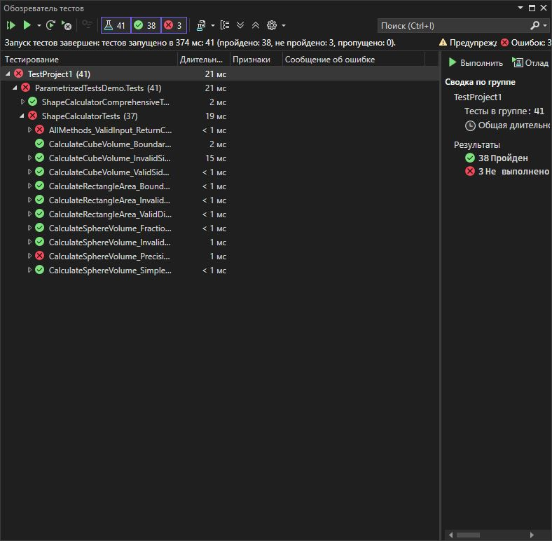

Практическая работа 6. Написание параметризированных тестов в xUnit
**Вариант: 15**

**Задание:**
Класс ShapeCalculator

double CalculateRectangleArea(double width, double height)
double CalculateCubeVolume(double side)
double CalculateSphereVolume(double radius)
## Структура проекта

- `StringCalculatorLib/`: Реализация метода `ReverseString`.
- `StringCalculatorLib.Tests/`: Юнит-тесты на данный метод.
- `images/`: Скриншот результатов тестирования.
- `README.md`: Инструкция и описание.

## Класс `StringUtils`

```csharp
using Xunit;
using ParametrizedTestsDemo;
using System;
using System.Collections;
using System.Collections.Generic;

namespace ParametrizedTestsDemo.Tests
{
    public class ShapeCalculatorTests
    {
        private readonly ShapeCalculator _calculator;

        public ShapeCalculatorTests()
        {
            _calculator = new ShapeCalculator();
        }

        #region Тестирование метода CalculateRectangleArea с использованием InlineData

        [Theory]
        [InlineData(5.0, 3.0, 15.0)]
        [InlineData(2.5, 4.0, 10.0)]
        [InlineData(1.0, 1.0, 1.0)]
        [InlineData(10.0, 0.5, 5.0)]
        [InlineData(7.5, 2.0, 15.0)]
        public void CalculateRectangleArea_ValidDimensions_ReturnsCorrectArea(
            double width, double height, double expected)
        {
            // Act
            double result = _calculator.CalculateRectangleArea(width, height);

            // Assert
            Assert.Equal(expected, result, 5);
        }

        [Theory]
        [InlineData(0, 5.0)]
        [InlineData(-2.5, 4.0)]
        [InlineData(3.0, 0)]
        [InlineData(2.0, -1.0)]
        [InlineData(-1.0, -1.0)]
        public void CalculateRectangleArea_InvalidDimensions_ThrowsArgumentException(
            double width, double height)
        {
            // Act & Assert
            Assert.Throws<ArgumentException>(() =>
                _calculator.CalculateRectangleArea(width, height));
        }

        #endregion

        #region Тестирование метода CalculateCubeVolume с использованием MemberData

        public static IEnumerable<object[]> CubeVolumeTestData
        {
            get
            {
                yield return new object[] { 1.0, 1.0 };           // side = 1, volume = 1
                yield return new object[] { 2.0, 8.0 };           // side = 2, volume = 8
                yield return new object[] { 3.0, 27.0 };          // side = 3, volume = 27
                yield return new object[] { 5.0, 125.0 };         // side = 5, volume = 125
                yield return new object[] { 0.5, 0.125 };         // side = 0.5, volume = 0.125
                yield return new object[] { 10.0, 1000.0 };       // side = 10, volume = 1000
            }
        }

        [Theory]
        [MemberData(nameof(CubeVolumeTestData))]
        public void CalculateCubeVolume_ValidSide_ReturnsCorrectVolume(
            double side, double expected)
        {
            // Act
            double result = _calculator.CalculateCubeVolume(side);

            // Assert
            Assert.Equal(expected, result, 5);
        }

        public static IEnumerable<object[]> InvalidCubeData
        {
            get
            {
                yield return new object[] { 0.0 };
                yield return new object[] { -1.0 };
                yield return new object[] { -5.5 };
                yield return new object[] { -0.001 };
            }
        }

        [Theory]
        [MemberData(nameof(InvalidCubeData))]
        public void CalculateCubeVolume_InvalidSide_ThrowsArgumentException(double side)
        {
            // Act & Assert
            var exception = Assert.Throws<ArgumentException>(() =>
                _calculator.CalculateCubeVolume(side));

            Assert.Contains("положительным числом", exception.Message);
        }

        #endregion

        #region Тестирование метода CalculateSphereVolume с использованием ClassData

        // Класс для тестовых данных сферы - простые случаи
        public class SphereVolumeSimpleTestData : IEnumerable<object[]>
        {
            public IEnumerator<object[]> GetEnumerator()
            {
                // Объем сферы: V = (4/3) * π * r³
                yield return new object[] { 1.0, (4.0 / 3.0) * Math.PI };      // r = 1
                yield return new object[] { 2.0, (4.0 / 3.0) * Math.PI * 8 };   // r = 2, r³ = 8
                yield return new object[] { 3.0, (4.0 / 3.0) * Math.PI * 27 };  // r = 3, r³ = 27
            }

            IEnumerator IEnumerable.GetEnumerator() => GetEnumerator();
        }

        [Theory]
        [ClassData(typeof(SphereVolumeSimpleTestData))]
        public void CalculateSphereVolume_SimpleCases_ReturnsCorrectVolume(
            double radius, double expected)
        {
            // Act
            double result = _calculator.CalculateSphereVolume(radius);

            // Assert
            Assert.Equal(expected, result, 5);
        }

        // Класс для тестовых данных сферы - дробные значения
        public class SphereVolumeFractionalTestData : IEnumerable<object[]>
        {
            public IEnumerator<object[]> GetEnumerator()
            {
                yield return new object[] { 0.5, (4.0 / 3.0) * Math.PI * 0.125 };   // r = 0.5, r³ = 0.125
                yield return new object[] { 1.5, (4.0 / 3.0) * Math.PI * 3.375 };   // r = 1.5, r³ = 3.375
                yield return new object[] { 2.5, (4.0 / 3.0) * Math.PI * 15.625 };  // r = 2.5, r³ = 15.625
            }

            IEnumerator IEnumerable.GetEnumerator() => GetEnumerator();
        }

        [Theory]
        [ClassData(typeof(SphereVolumeFractionalTestData))]
        public void CalculateSphereVolume_FractionalRadius_ReturnsCorrectVolume(
            double radius, double expected)
        {
            // Act
            double result = _calculator.CalculateSphereVolume(radius);

            // Assert
            Assert.Equal(expected, result, 5);
        }

        // Класс для невалидных данных сферы
        public class InvalidSphereTestData : IEnumerable<object[]>
        {
            public IEnumerator<object[]> GetEnumerator()
            {
                yield return new object[] { 0.0 };
                yield return new object[] { -1.0 };
                yield return new object[] { -2.5 };
                yield return new object[] { -0.01 };
            }

            IEnumerator IEnumerable.GetEnumerator() => GetEnumerator();
        }

        [Theory]
        [ClassData(typeof(InvalidSphereTestData))]
        public void CalculateSphereVolume_InvalidRadius_ThrowsArgumentException(double radius)
        {
            // Act & Assert
            Assert.Throws<ArgumentException>(() =>
                _calculator.CalculateSphereVolume(radius));
        }

        #endregion

        #region Комбинированные тесты с использованием всех трех методов

        // Дополнительные тестовые данные через MemberData
        public static IEnumerable<object[]> CombinedTestData
        {
            get
            {
                // Прямоугольник, куб, сфера
                yield return new object[] { 2.0, 3.0, 6.0, 8.0, (4.0 / 3.0) * Math.PI }; // side = 2, radius = 1
                yield return new object[] { 4.0, 5.0, 20.0, 64.0, (4.0 / 3.0) * Math.PI * 27 }; // side = 4, radius = 3
            }
        }

        [Theory]
        [MemberData(nameof(CombinedTestData))]
        public void AllMethods_ValidInput_ReturnCorrectResults(
            double width, double height, double expectedArea,
            double expectedCubeVolume, double expectedSphereVolume)
        {
            // Act & Assert для прямоугольника
            double areaResult = _calculator.CalculateRectangleArea(width, height);
            Assert.Equal(expectedArea, areaResult, 5);

            // Act & Assert для куба (используем ширину как сторону куба)
            double cubeResult = _calculator.CalculateCubeVolume(width);
            Assert.Equal(expectedCubeVolume, cubeResult, 5);

            // Act & Assert для сферы (используем высоту как радиус)
            double sphereResult = _calculator.CalculateSphereVolume(height);
            Assert.Equal(expectedSphereVolume, sphereResult, 5);
        }

        #endregion

        #region Тесты с граничными значениями

        [Theory]
        [InlineData(double.Epsilon, double.Epsilon, double.Epsilon * double.Epsilon)]
        [InlineData(double.MaxValue, 1.0, double.MaxValue)]
        public void CalculateRectangleArea_BoundaryValues_ReturnsExpectedResult(
            double width, double height, double expected)
        {
            // Act
            double result = _calculator.CalculateRectangleArea(width, height);

            // Assert
            Assert.Equal(expected, result, 5);
        }

        [Theory]
        [InlineData(double.Epsilon, double.Epsilon * double.Epsilon * double.Epsilon)]
        
        public void CalculateCubeVolume_BoundaryValues_ReturnsExpectedResult(
            double side, double expected)
        {
            // Act
            double result = _calculator.CalculateCubeVolume(side);

            // Assert
            Assert.Equal(expected, result, 5);
        }

        #endregion

        #region Тесты с округлением и точностью

        [Theory]
        [InlineData(1.0, 3.141592653589793, 12)] // π
        [InlineData(2.0, 33.51032163829113, 10)] // (4/3)π * 8
        public void CalculateSphereVolume_PrecisionTests_ReturnsCorrectValue(
            double radius, double expected, int precision)
        {
            // Act
            double result = _calculator.CalculateSphereVolume(radius);

            // Assert
            Assert.Equal(expected, result, precision);
        }

        #endregion
    }

    #region Дополнительные классы для тестовых данных

    // Класс с большим набором тестовых данных для комплексного тестирования
    public class ComprehensiveTestData : IEnumerable<object[]>
    {
        public IEnumerator<object[]> GetEnumerator()
        {
            // Формат: [ширина, высота, площадь, сторона куба, объем куба, радиус сферы, объем сферы]

            // Тест 1: Малые значения
            yield return new object[] { 1.0, 1.0, 1.0, 1.0, 1.0, 1.0, (4.0 / 3.0) * Math.PI };

            // Тест 2: Средние значения
            yield return new object[] { 3.0, 4.0, 12.0, 3.0, 27.0, 2.0, (4.0 / 3.0) * Math.PI * 8 };

            // Тест 3: Большие значения
            yield return new object[] { 10.0, 20.0, 200.0, 10.0, 1000.0, 5.0, (4.0 / 3.0) * Math.PI * 125 };

            // Тест 4: Дробные значения
            yield return new object[] { 2.5, 3.5, 8.75, 2.5, 15.625, 1.5, (4.0 / 3.0) * Math.PI * 3.375 };
        }

        IEnumerator IEnumerable.GetEnumerator() => GetEnumerator();
    }

    public class ShapeCalculatorComprehensiveTests
    {
        private readonly ShapeCalculator _calculator = new ShapeCalculator();

        [Theory]
        [ClassData(typeof(ComprehensiveTestData))]
        public void ComprehensiveTest_AllMethods_ReturnCorrectResults(
            double width, double height, double expectedArea,
            double cubeSide, double expectedCubeVolume,
            double sphereRadius, double expectedSphereVolume)
        {
            // Act & Assert для прямоугольника
            double areaResult = _calculator.CalculateRectangleArea(width, height);
            Assert.Equal(expectedArea, areaResult, 5);

            // Act & Assert для куба
            double cubeResult = _calculator.CalculateCubeVolume(cubeSide);
            Assert.Equal(expectedCubeVolume, cubeResult, 5);

            // Act & Assert для сферы
            double sphereResult = _calculator.CalculateSphereVolume(sphereRadius);
            Assert.Equal(expectedSphereVolume, sphereResult, 5);
        }
    }

    #endregion
}
```

```csharp
using System;

namespace ParametrizedTestsDemo
{
    public class ShapeCalculator
    {
        /// <summary>
        /// Вычисляет площадь прямоугольника
        /// </summary>
        /// <param name="width">Ширина прямоугольника</param>
        /// <param name="height">Высота прямоугольника</param>
        /// <returns>Площадь прямоугольника</returns>
        public double CalculateRectangleArea(double width, double height)
        {
            if (width <= 0)
                throw new ArgumentException("Ширина должна быть положительным числом", nameof(width));

            if (height <= 0)
                throw new ArgumentException("Высота должна быть положительным числом", nameof(height));

            return width * height;
        }

        /// <summary>
        /// Вычисляет объем куба
        /// </summary>
        /// <param name="side">Длина стороны куба</param>
        /// <returns>Объем куба</returns>
        public double CalculateCubeVolume(double side)
        {
            if (side <= 0)
                throw new ArgumentException("Длина стороны должна быть положительным числом", nameof(side));

            return Math.Pow(side, 3);
        }

        /// <summary>
        /// Вычисляет объем сферы
        /// </summary>
        /// <param name="radius">Радиус сферы</param>
        /// <returns>Объем сферы</returns>
        public double CalculateSphereVolume(double radius)
        {
            if (radius <= 0)
                throw new ArgumentException("Радиус должен быть положительным числом", nameof(radius));

            return (4.0 / 3.0) * Math.PI * Math.Pow(radius, 3);
        }
    }
}
```
