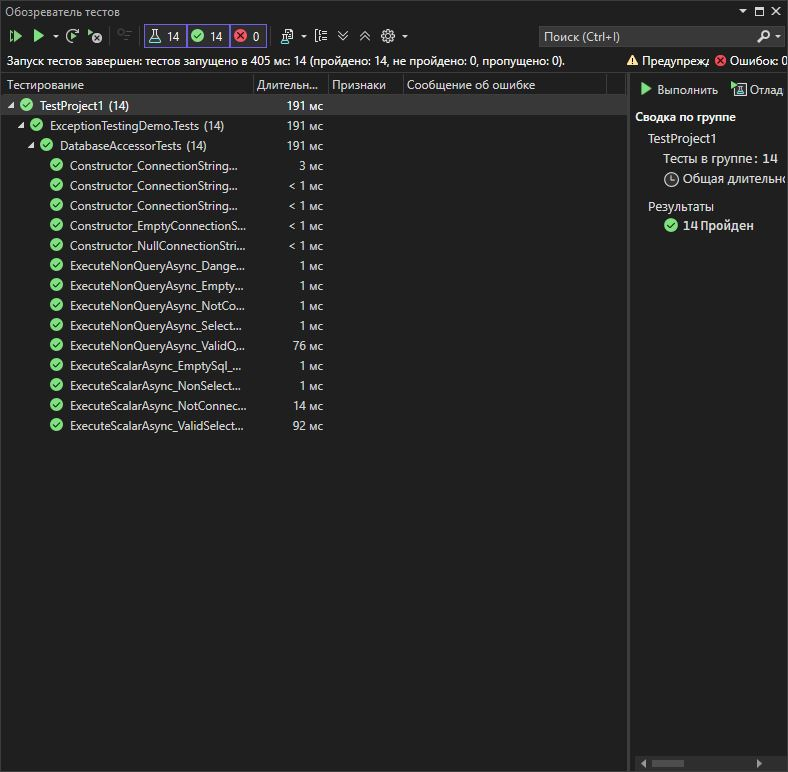

# Практическая работа 7. Тестирование исключений с помощью Assert.Throws в xUnit
**Вариант: 15**

**Задание:**
Вариант :15 Вариант 15: Класс DatabaseAccessor с методами:

async Task<int> ExecuteNonQueryAsync(string sql)
async Task<object> ExecuteScalarAsync(string sql)
void ValidateConnectionString(string connectionString)
## Структура проекта
ExceptionTestingSolution/
├── ExceptionTestingDemo/
│   ├── DatabaseAccessor.cs
│   └── ExceptionTestingDemo.csproj
├── ExceptionTestingDemo.Tests/
│   ├── DatabaseAccessorTests.cs
│   └── ExceptionTestingDemo.Tests.csproj
├── images/
│   └── test-results.png (скриншот результатов тестов)
└── README.md (этот файл)

## Класс `StringUtils`

```csharp
using Xunit;
using ExceptionTestingDemo;
using System;
using System.Threading.Tasks;

namespace ExceptionTestingDemo.Tests
{
    public class DatabaseAccessorTests
    {
        private const string ValidConnectionString =
            "Server=localhost;Database=TestDB;User Id=user;Password=securePass123;";

        // Тест 1: Конструктор с пустой строкой подключения
        [Fact]
        public void Constructor_EmptyConnectionString_ThrowsArgumentException()
        {
            // Act & Assert
            var exception = Assert.Throws<ArgumentException>(() =>
                new DatabaseAccessor(""));

            Assert.Equal("connectionString", exception.ParamName);
            Assert.Contains("cannot be null or empty", exception.Message);
        }

        // Тест 2: Конструктор с null строкой подключения
        [Fact]
        public void Constructor_NullConnectionString_ThrowsArgumentException()
        {
            // Act & Assert
            var exception = Assert.Throws<ArgumentException>(() =>
                new DatabaseAccessor(null));

            Assert.Equal("connectionString", exception.ParamName);
        }

        // Тест 3: Конструктор с строкой без информации о сервере
        [Fact]
        public void Constructor_ConnectionStringWithoutServer_ThrowsArgumentException()
        {
            // Arrange
            string invalidConnectionString = "Database=TestDB;User Id=user;Password=pass;";

            // Act & Assert
            var exception = Assert.Throws<ArgumentException>(() =>
                new DatabaseAccessor(invalidConnectionString));

            Assert.Equal("connectionString", exception.ParamName);
            Assert.Contains("server information", exception.Message);
        }

        // Тест 4: Конструктор с строкой без информации о базе данных
        [Fact]
        public void Constructor_ConnectionStringWithoutDatabase_ThrowsArgumentException()
        {
            // Arrange
            string invalidConnectionString = "Server=localhost;User Id=user;Password=pass;";

            // Act & Assert
            var exception = Assert.Throws<ArgumentException>(() =>
                new DatabaseAccessor(invalidConnectionString));

            Assert.Equal("connectionString", exception.ParamName);
            Assert.Contains("database name", exception.Message);
        }

        // Тест 5: Конструктор с простым паролем
        [Fact]
        public void Constructor_ConnectionStringWithWeakPassword_ThrowsArgumentException()
        {
            // Arrange
            string weakPasswordConnectionString =
                "Server=localhost;Database=TestDB;User Id=user;Password=123456;";

            // Act & Assert
            var exception = Assert.Throws<ArgumentException>(() =>
                new DatabaseAccessor(weakPasswordConnectionString));

            Assert.Equal("connectionString", exception.ParamName);
            Assert.Contains("Weak password", exception.Message);
        }

        // Тест 6: ExecuteNonQueryAsync с пустым SQL
        [Fact]
        public async Task ExecuteNonQueryAsync_EmptySql_ThrowsArgumentException()
        {
            // Arrange
            var accessor = new DatabaseAccessor(ValidConnectionString);

            // Act & Assert
            var exception = await Assert.ThrowsAsync<ArgumentException>(() =>
                accessor.ExecuteNonQueryAsync(""));

            Assert.Equal("sql", exception.ParamName);
            Assert.Contains("cannot be null or empty", exception.Message);
        }

        // Тест 7: ExecuteNonQueryAsync без подключения
        [Fact]
        public async Task ExecuteNonQueryAsync_NotConnected_ThrowsInvalidOperationException()
        {
            // Arrange
            var accessor = new DatabaseAccessor(ValidConnectionString);
            accessor.Disconnect();

            // Act & Assert
            var exception = await Assert.ThrowsAsync<InvalidOperationException>(() =>
                accessor.ExecuteNonQueryAsync("UPDATE Users SET Name='Test'"));

            Assert.Contains("not connected", exception.Message);
        }

        // Тест 8: ExecuteNonQueryAsync с SELECT запросом
        [Fact]
        public async Task ExecuteNonQueryAsync_SelectQuery_ThrowsInvalidSqlException()
        {
            // Arrange
            var accessor = new DatabaseAccessor(ValidConnectionString);

            // Act & Assert
            var exception = await Assert.ThrowsAsync<InvalidSqlException>(() =>
                accessor.ExecuteNonQueryAsync("SELECT * FROM Users"));

            Assert.Equal("SELECT_NOT_ALLOWED", exception.ErrorCode);
            Assert.Contains("cannot execute SELECT", exception.Message);
        }

        // Тест 9: ExecuteNonQueryAsync с опасной операцией
        [Fact]
        public async Task ExecuteNonQueryAsync_DangerousOperation_ThrowsInvalidSqlException()
        {
            // Arrange
            var accessor = new DatabaseAccessor(ValidConnectionString);

            // Act & Assert
            var exception = await Assert.ThrowsAsync<InvalidSqlException>(() =>
                accessor.ExecuteNonQueryAsync("DROP DATABASE ProductionDB"));

            Assert.Equal("DANGEROUS_OPERATION", exception.ErrorCode);
            Assert.Contains("Dangerous operation", exception.Message);
        }

        // Тест 10: ExecuteScalarAsync с пустым SQL
        [Fact]
        public async Task ExecuteScalarAsync_EmptySql_ThrowsArgumentException()
        {
            // Arrange
            var accessor = new DatabaseAccessor(ValidConnectionString);

            // Act & Assert
            var exception = await Assert.ThrowsAsync<ArgumentException>(() =>
                accessor.ExecuteScalarAsync(""));

            Assert.Equal("sql", exception.ParamName);
        }

        // Тест 11: ExecuteScalarAsync с не-SELECT запросом
        [Fact]
        public async Task ExecuteScalarAsync_NonSelectQuery_ThrowsInvalidSqlException()
        {
            // Arrange
            var accessor = new DatabaseAccessor(ValidConnectionString);

            // Act & Assert
            var exception = await Assert.ThrowsAsync<InvalidSqlException>(() =>
                accessor.ExecuteScalarAsync("INSERT INTO Users VALUES (1, 'Test')"));

            Assert.Equal("NON_SELECT_QUERY", exception.ErrorCode);
            Assert.Contains("can only execute SELECT", exception.Message);
        }

        // Тест 12: ExecuteScalarAsync без подключения
        [Fact]
        public async Task ExecuteScalarAsync_NotConnected_ThrowsInvalidOperationException()
        {
            // Arrange
            var accessor = new DatabaseAccessor(ValidConnectionString);
            accessor.Disconnect();

            // Act & Assert
            var exception = await Assert.ThrowsAsync<InvalidOperationException>(() =>
                accessor.ExecuteScalarAsync("SELECT COUNT(*) FROM Users"));

            Assert.Contains("not connected", exception.Message);
        }

        // Дополнительный тест: Успешное выполнение ExecuteNonQueryAsync
        [Fact]
        public async Task ExecuteNonQueryAsync_ValidQuery_ReturnsResult()
        {
            // Arrange
            var accessor = new DatabaseAccessor(ValidConnectionString);

            // Act
            var result = await accessor.ExecuteNonQueryAsync("UPDATE Users SET Name='Test' WHERE Id=1");

            // Assert
            Assert.Equal(1, result);
        }

        // Дополнительный тест: Успешное выполнение ExecuteScalarAsync
        [Fact]
        public async Task ExecuteScalarAsync_ValidSelect_ReturnsData()
        {
            // Arrange
            var accessor = new DatabaseAccessor(ValidConnectionString);

            // Act
            var result = await accessor.ExecuteScalarAsync("SELECT Name FROM Users WHERE Id=1");

            // Assert
            Assert.NotNull(result);
            Assert.Equal("SampleData", result);
        }
    }
}
```

```csharp
using System;
using System.Threading.Tasks;

namespace ExceptionTestingDemo
{
    // Пользовательское исключение для невалидных SQL-запросов
    public class InvalidSqlException : Exception
    {
        public string SqlQuery { get; }
        public string ErrorCode { get; }

        public InvalidSqlException(string sqlQuery, string errorCode, string message)
            : base(message)
        {
            SqlQuery = sqlQuery;
            ErrorCode = errorCode;
        }
    }

    public class DatabaseAccessor
    {
        private string _connectionString;
        private bool _isConnected;

        public DatabaseAccessor(string connectionString)
        {
            ValidateConnectionString(connectionString);
            _connectionString = connectionString;
            _isConnected = true; // После успешной валидации считаем подключенным
        }

        /// <summary>
        /// Выполняет SQL-запрос, не возвращающий данные (INSERT, UPDATE, DELETE)
        /// </summary>
        public async Task<int> ExecuteNonQueryAsync(string sql)
        {
            if (string.IsNullOrWhiteSpace(sql))
                throw new ArgumentException("SQL query cannot be null or empty", nameof(sql));

            if (!_isConnected)
                throw new InvalidOperationException("Database is not connected");

            if (sql.Trim().ToUpper().StartsWith("SELECT"))
                throw new InvalidSqlException(sql, "SELECT_NOT_ALLOWED",
                    "ExecuteNonQueryAsync cannot execute SELECT queries");

            // Имитация опасной операции
            if (sql.ToUpper().Contains("DROP DATABASE"))
                throw new InvalidSqlException(sql, "DANGEROUS_OPERATION",
                    "Dangerous operation detected: DROP DATABASE");

            // Имитация выполнения запроса
            await Task.Delay(50);
            return 1; // Имитация успешного выполнения
        }

        /// <summary>
        /// Выполняет SQL-запрос, возвращающий одно значение
        /// </summary>
        public async Task<object> ExecuteScalarAsync(string sql)
        {
            if (string.IsNullOrWhiteSpace(sql))
                throw new ArgumentException("SQL query cannot be null or empty", nameof(sql));

            if (!_isConnected)
                throw new InvalidOperationException("Database is not connected");

            if (!sql.Trim().ToUpper().StartsWith("SELECT"))
                throw new InvalidSqlException(sql, "NON_SELECT_QUERY",
                    "ExecuteScalarAsync can only execute SELECT queries");

            // Имитация выполнения запроса
            await Task.Delay(50);
            return "SampleData";
        }

        /// <summary>
        /// Валидирует строку подключения к базе данных
        /// </summary>
        public void ValidateConnectionString(string connectionString)
        {
            if (string.IsNullOrWhiteSpace(connectionString))
                throw new ArgumentException("Connection string cannot be null or empty", nameof(connectionString));

            if (!connectionString.Contains("Server=") && !connectionString.Contains("Data Source="))
                throw new ArgumentException("Connection string must contain server information", nameof(connectionString));

            if (!connectionString.Contains("Database=") && !connectionString.Contains("Initial Catalog="))
                throw new ArgumentException("Connection string must contain database name", nameof(connectionString));

            // Проверка на простые пароли
            if (connectionString.Contains("Password="))
            {
                int passwordStart = connectionString.IndexOf("Password=") + 9;
                int passwordEnd = connectionString.IndexOf(";", passwordStart);
                if (passwordEnd == -1) passwordEnd = connectionString.Length;
                string password = connectionString.Substring(passwordStart, passwordEnd - passwordStart);

                if (password == "123456" || password == "password")
                    throw new ArgumentException("Weak password detected", nameof(connectionString));
            }
        }

        /// <summary>
        /// Метод для тестирования - отключает базу данных
        /// </summary>
        public void Disconnect()
        {
            _isConnected = false;
        }
    }
}
```
