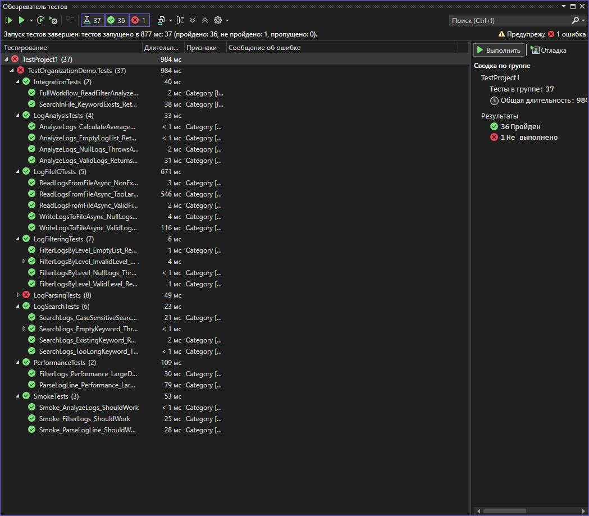

# Практическая работа 8. Организация тестов в группы с помощью Trait и Category
**Вариант: 15**

**Задание:**
Вариант 15:  Анализатор логов (LogAnalyzer)

Тесты для парсинга, фильтрации, анализа логов
Категории: Unit, Integration, FileIO
Стабильность: Stable, Slow
## Структура проекта

- `StringCalculatorLib/`: Реализация метода `ReverseString`.
- `StringCalculatorLib.Tests/`: Юнит-тесты на данный метод.
- `images/`: Скриншот результатов тестирования.
- `README.md`: Инструкция и описание.

## Класс `StringUtils`

```csharp
using Xunit;
using TestOrganizationDemo;
using System;
using System.Collections.Generic;
using System.IO;
using System.Linq;
using System.Threading.Tasks;

namespace TestOrganizationDemo.Tests
{
    #region Unit тесты - парсинг логов

    [Trait(Traits.Category, Traits.Categories.Unit)]
    [Trait(Traits.Feature, Traits.Features.Parsing)]
    public class LogParsingTests
    {
        private readonly LogAnalyzer _analyzer = new LogAnalyzer();

        [Trait(Traits.Priority, Traits.Priorities.Critical)]
        [Trait(Traits.Type, Traits.Types.Positive)]
        [Trait(Traits.Stability, Traits.Stabilities.Stable)]
        [Fact]
        public void ParseLogLine_ValidInfoLog_ReturnsCorrectLogEntry()
        {
            // Arrange
            string logLine = "2024-01-15 10:30:45 INFO: User logged in successfully";

            // Act
            var entry = _analyzer.ParseLogLine(logLine);

            // Assert
            Assert.Equal("2024-01-15 10:30:45", entry.Timestamp);
            Assert.Equal("INFO", entry.Level);
            Assert.Equal("User logged in successfully", entry.Message);
        }

        [Trait(Traits.Priority, Traits.Priorities.High)]
        [Trait(Traits.Type, Traits.Types.Negative)]
        [Trait(Traits.Stability, Traits.Stabilities.Stable)]
        [Theory]
        [InlineData(null)]
        [InlineData("")]
        [InlineData("   ")]
        public void ParseLogLine_EmptyOrNullLine_ThrowsArgumentException(string logLine)
        {
            // Act & Assert
            Assert.Throws<ArgumentException>(() => _analyzer.ParseLogLine(logLine));
        }

        [Trait(Traits.Priority, Traits.Priorities.Medium)]
        [Trait(Traits.Type, Traits.Types.Boundary)]
        [Trait(Traits.Stability, Traits.Stabilities.Stable)]
        [Fact]
        public void ParseLogLine_VeryLongLine_ThrowsArgumentException()
        {
            // Arrange
            string longLine = new string('A', 10001);

            // Act & Assert
            Assert.Throws<ArgumentException>(() => _analyzer.ParseLogLine(longLine));
        }

        [Trait(Traits.Priority, Traits.Priorities.Medium)]
        [Trait(Traits.Type, Traits.Types.Positive)]
        [Trait(Traits.Stability, Traits.Stabilities.Stable)]
        [Theory]
        [InlineData("2024-01-15 10:30:45 ERROR: Database connection failed")]
        [InlineData("2024-01-15 10:30:45 WARN: High memory usage detected")]
        [InlineData("2024-01-15 10:30:45 DEBUG: Processing request...")]
        public void ParseLogLine_DifferentLogLevels_ReturnsCorrectLevel(string logLine)
        {
            // Act
            var entry = _analyzer.ParseLogLine(logLine);

            // Assert
            Assert.NotNull(entry.Level);
            Assert.InRange(entry.Level.Length, 1, 10);
        }
    }

    #endregion

    #region Unit тесты - фильтрация логов

    [Trait(Traits.Category, Traits.Categories.Unit)]
    [Trait(Traits.Feature, Traits.Features.Filtering)]
    public class LogFilteringTests
    {
        private readonly LogAnalyzer _analyzer = new LogAnalyzer();
        private readonly List<LogEntry> _sampleLogs;

        public LogFilteringTests()
        {
            _sampleLogs = new List<LogEntry>
            {
                new LogEntry { Level = "INFO", Message = "System started" },
                new LogEntry { Level = "ERROR", Message = "Failed to connect" },
                new LogEntry { Level = "WARN", Message = "High CPU usage" },
                new LogEntry { Level = "INFO", Message = "User logged in" },
                new LogEntry { Level = "ERROR", Message = "Database timeout" }
            };
        }


```

```csharp
using System;
using System.Collections.Generic;
using System.IO;
using System.Linq;
using System.Text;
using System.Text.RegularExpressions;

namespace TestOrganizationDemo
{
    /// <summary>
    /// Класс для анализа логов
    /// </summary>
    public class LogAnalyzer
    {
        /// <summary>
        /// Анализирует строку лога и извлекает информацию
        /// </summary>
        public LogEntry ParseLogLine(string logLine)
        {
            if (string.IsNullOrWhiteSpace(logLine))
                throw new ArgumentException("Log line cannot be null or empty", nameof(logLine));

            if (logLine.Length > 10000)
                throw new ArgumentException("Log line is too long", nameof(logLine));

            var patterns = new Dictionary<string, string>
            {
                { "timestamp", @"\d{4}-\d{2}-\d{2} \d{2}:\d{2}:\d{2}" },
                { "level", @"(INFO|WARN|ERROR|DEBUG)" },
                { "message", @":\s*(.+)$" }
            };

            string timestamp = ExtractPattern(logLine, patterns["timestamp"], "DateTime.Now");
            string level = ExtractPattern(logLine, patterns["level"], "INFO");
            string message = ExtractPattern(logLine, patterns["message"], logLine);

            return new LogEntry
            {
                Timestamp = timestamp,
                Level = level,
                Message = message,
                OriginalLine = logLine
            };
        }

        /// <summary>
        /// Фильтрует логи по уровню
        /// </summary>
        public List<LogEntry> FilterLogsByLevel(List<LogEntry> logs, string level)
        {
            if (logs == null)
                throw new ArgumentNullException(nameof(logs));

            if (string.IsNullOrWhiteSpace(level))
                throw new ArgumentException("Level cannot be empty", nameof(level));

            var validLevels = new[] { "INFO", "WARN", "ERROR", "DEBUG" };
            if (!validLevels.Contains(level.ToUpper()))
                throw new ArgumentException($"Invalid log level. Valid levels: {string.Join(", ", validLevels)}", nameof(level));

            return logs.Where(log => log.Level.Equals(level, StringComparison.OrdinalIgnoreCase)).ToList();
        }

        /// <summary>
        /// Ищет логи по ключевому слову
        /// </summary>
        public List<LogEntry> SearchLogs(List<LogEntry> logs, string keyword, bool caseSensitive = false)
        {
            if (logs == null)
                throw new ArgumentNullException(nameof(logs));

            if (string.IsNullOrWhiteSpace(keyword))
                throw new ArgumentException("Keyword cannot be empty", nameof(keyword));

            if (keyword.Length > 100)
                throw new ArgumentException("Keyword is too long", nameof(keyword));

            var comparison = caseSensitive ? StringComparison.Ordinal : StringComparison.OrdinalIgnoreCase;
            return logs.Where(log => log.Message.IndexOf(keyword, comparison) >= 0).ToList();
        }

        /// <summary>
        /// Анализирует статистику логов
        /// </summary>

```
