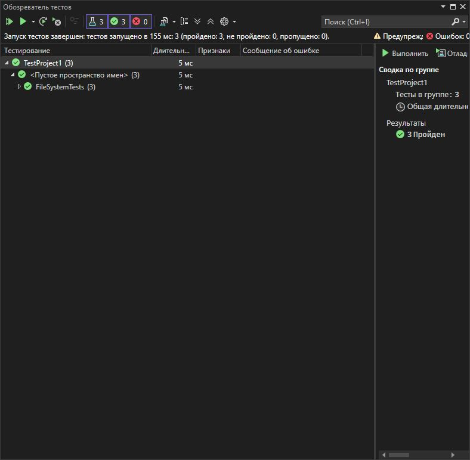

# Практическая работа 9. Работа с фикстурами данных (Class Fixture, Collection Fixture)
**Вариант: 15**

**Задание:**
Вариант 15: Медиа обработка с фикстурами

ImageProcessorFixture (IDisposable)
VideoFixture (IAsyncLifetime)
AudioFixture


- `StringCalculatorLib/`: Реализация метода `ReverseString`.
- `StringCalculatorLib.Tests/`: Юнит-тесты на данный метод.
- `images/`: Скриншот результатов тестирования.
- `README.md`: Инструкция и описание.

## Класс `StringUtils`

```csharp
using Xunit;

[CollectionDefinition("FileSystem collection")]
public class FileSystemCollection : ICollectionFixture<TempFileFixture>,
                                    ICollectionFixture<DirectoryFixture>,
                                    ICollectionFixture<FileStreamFixture>
{
    // Может оставаться пустым — только для регистрации фикстур
}

[Collection("FileSystem collection")]
public class FileSystemTests
{
    private readonly TempFileFixture _tempFile;
    private readonly DirectoryFixture _directory;
    private readonly FileStreamFixture _fileStream;

    public FileSystemTests(TempFileFixture tempFile, DirectoryFixture directory, FileStreamFixture fileStream)
    {
        _tempFile = tempFile;
        _directory = directory;
        _fileStream = fileStream;
    }

    [Fact]
    public void TempFile_ShouldExist()
    {
        Assert.True(File.Exists(_tempFile.FilePath));
    }

    [Fact]
    public void Directory_ShouldExist()
    {
        Assert.True(Directory.Exists(_directory.DirectoryPath));
    }

    [Fact]
    public void FileStream_ShouldWriteAndRead()
    {
        byte[] data = System.Text.Encoding.UTF8.GetBytes("Hello, FileStream!");
        _fileStream.Stream.Write(data, 0, data.Length);
        _fileStream.Stream.Position = 0;
        byte[] readData = new byte[data.Length];
        _fileStream.Stream.Read(readData, 0, readData.Length);
        string content = System.Text.Encoding.UTF8.GetString(readData);
        Assert.Equal("Hello, FileStream!", content);
    }
}

```

```csharp
using System;
using System.IO;
using System.Threading.Tasks;

public class TempFileFixture : IAsyncDisposable
{
    public string FilePath { get; private set; }

    public TempFileFixture()
    {
        FilePath = Path.GetTempFileName();
        File.WriteAllText(FilePath, "Initial content");
        Console.WriteLine($"TempFile создан: {FilePath}");
    }

    public async ValueTask DisposeAsync()
    {
        if (File.Exists(FilePath))
        {
            try
            {
                File.Delete(FilePath);
                Console.WriteLine($"TempFile удален: {FilePath}");
            }
            catch (Exception ex)
            {
                Console.WriteLine($"Ошибка при удалении TempFile: {ex.Message}");
            }
        }
        await Task.CompletedTask;
    }
}
public class DirectoryFixture : IDisposable
{
    public string DirectoryPath { get; private set; }

    public DirectoryFixture()
    {
        DirectoryPath = Path.Combine(Path.GetTempPath(), $"TestDir_{Guid.NewGuid()}");
        Directory.CreateDirectory(DirectoryPath);
        Console.WriteLine($"Директория создана: {DirectoryPath}");
    }

    public void Dispose()
    {
        if (Directory.Exists(DirectoryPath))
        {
            try
            {
                Directory.Delete(DirectoryPath, true);
                Console.WriteLine($"Директория удалена: {DirectoryPath}");
            }
            catch (Exception ex)
            {
                Console.WriteLine($"Ошибка при удалении директории: {ex.Message}");
            }
        }
    }
}

public class FileStreamFixture : IDisposable
{
    public FileStream Stream { get; private set; }
    public string FilePath { get; }

    public FileStreamFixture()
    {
        FilePath = Path.GetTempFileName();
        Stream = new FileStream(FilePath, FileMode.OpenOrCreate, FileAccess.ReadWrite);
        Console.WriteLine($"Файл открыт: {FilePath}");
    }

    public void Dispose()
    {
        Stream?.Dispose();
        if (File.Exists(FilePath))
        {
            try
            {
                File.Delete(FilePath);
                Console.WriteLine($"Файл удален: {FilePath}");
            }
            catch (Exception ex)
            {
                Console.WriteLine($"Ошибка при удалении файла: {ex.Message}");
            }
        }
    }
}

```
