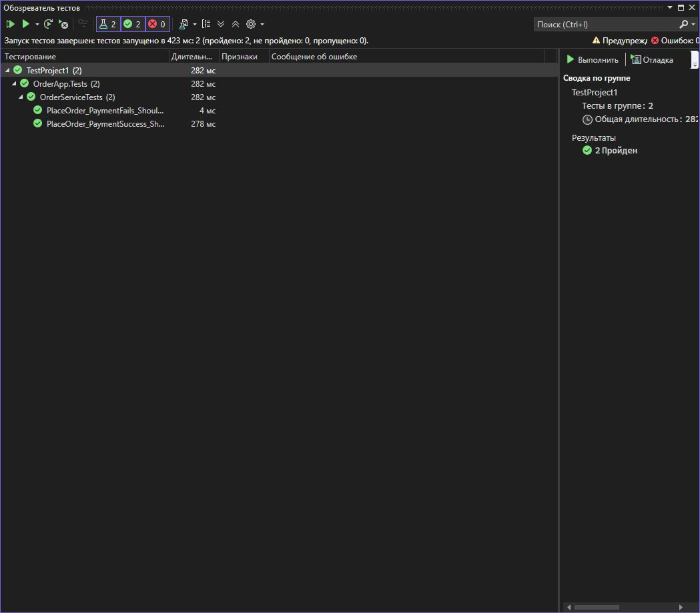

# Практическая работа №10  
## Изоляция класса тестирования с помощью Moq  

**Вариант:** 15 
**Тема:** Протестировать LoginService, изолировав IUserRepository и IAuditLogger.
### 📄 Задание
- Реализовать класс `OrderService`, который:
  - принимает заказ
  - взаимодействует с `IPaymentGateway` для списания суммы
  - сохраняет заказ через `IOrderRepository`
- Написать модульные тесты, изолировав зависимости с помощью Moq:
  1. Успешная оплата — заказ сохраняется  
  2. Неудачная оплата — заказ не сохраняется  
  3. Проверить, что метод Charge вызывается с правильной суммой

### 💻 Пример теста
```csharp
using Xunit;
using Moq;
using OrderApp;

namespace OrderApp.Tests
{
    public class OrderServiceTests
    {
        [Fact]
        public void PlaceOrder_PaymentSuccess_ShouldSaveOrder()
        {
            // Arrange
            var mockRepo = new Mock<IOrderRepository>();
            var mockPayment = new Mock<IPaymentGateway>();
            var order = new Order { Total = 100m, IsPaid = false };

            // Настройка поведения мок-объекта
            mockPayment.Setup(p => p.Charge(100m)).Returns(true);

            var service = new OrderService(mockRepo.Object, mockPayment.Object);

            // Act
            var result = service.PlaceOrder(order);

            // Assert
            Assert.True(result);
            Assert.True(order.IsPaid);
            mockRepo.Verify(r => r.Save(order), Times.Once);
            mockPayment.Verify(p => p.Charge(100m), Times.Once);
        }

        [Fact]
        public void PlaceOrder_PaymentFails_ShouldNotSaveOrder()
        {
            // Arrange
            var mockRepo = new Mock<IOrderRepository>();
            var mockPayment = new Mock<IPaymentGateway>();
            var order = new Order { Total = 50m, IsPaid = false };

            mockPayment.Setup(p => p.Charge(50m)).Returns(false);

            var service = new OrderService(mockRepo.Object, mockPayment.Object);

            // Act
            var result = service.PlaceOrder(order);

            // Assert
            Assert.False(result);
            Assert.False(order.IsPaid);
            mockRepo.Verify(r => r.Save(It.IsAny<Order>()), Times.Never);
            mockPayment.Verify(p => p.Charge(50m), Times.Once);
        }
    }
}
```
